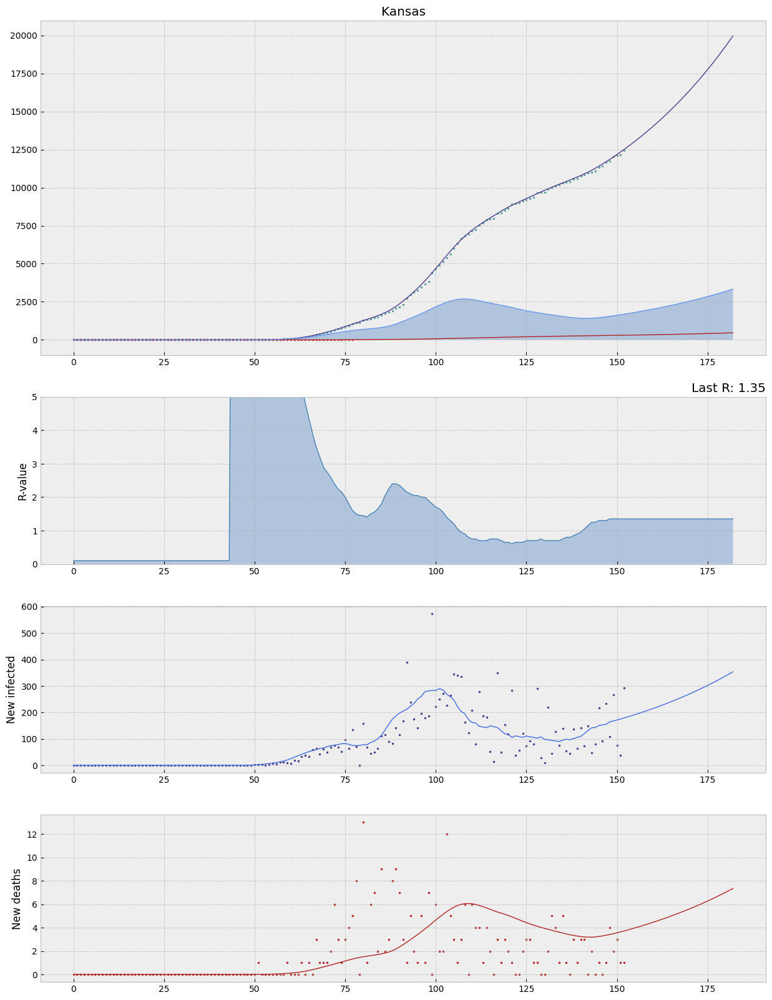

# A SEIRD model for COVID-19

This python script tries to calculate the current R-value per state, and outputs JSON files that can be used to visualize different graphs or maps.

The generated JSON files are suitable for use with for example [amCharts](https://www.amcharts.com/).

## Installing
### Download repository

    git clone git@github.com:tbuytaer/seird.git

### Install necessary libraries

    python3 -m pip install --user matplotlib

or

    python3 -m pip install matplotlib

Python 3.6 or above should work.

## How to

All needed CSV files will be downloaded from Johns Hopkins' [GitHub repository](https://github.com/CSSEGISandData/COVID-19) and saved in subfolder `johns-hopkins-data/`

Generated JSON files will be output in subfolder `export/`

You can choose for what region you want to generate the files.

    python3 seird.py <region>

Valid options are: `all`,  `world`, `USA`

## Graph output

After generating the JSON files, a graph will be output for one of the states.

---
## Disclaimer

***Predicting the future is hard, and depends on a lot of factors that evolve over time. So take these calculations and forecasts with lots of grains of salt.***

These graphs and some of the numbers on them are based on a model. All models are just approximations of real life, are based on a set of assumptions, and have their limits.

The level of testing differs per country and also evolves over time. Countries differ in how they count cases. This makes it difficult to compare numbers directly.

Calculated values are based on a SEIR model that uses data from [Johns Hopkins University](https://github.com/CSSEGISandData/COVID-19) to estimate Re and other values.

One of the assumptions of this model is that all new infections are caused by people *inside* this state. If most infections come from abroad, this will cause a (fictitious) spike in Re values.